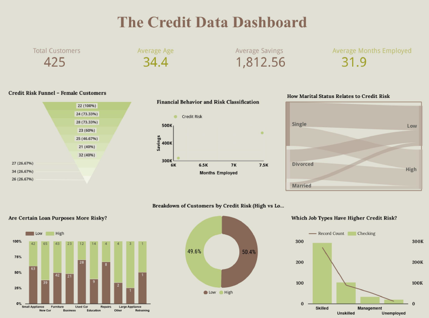

# Credit Risk Analysis: Interactive Looker Studio Dashboard

An interactive business intelligence dashboard built in Google Looker Studio to explore customer credit risk patterns across 425 records. Features seven chart types covering risk distribution, loan purpose analysis, demographic segmentation, and financial behavior visualization.

<p align="center">
  <a href="https://lookerstudio.google.com/reporting/e9b25dcd-433c-421b-9d9d-866aee7d06cf">View Live Dashboard - Looker Studio</a>
</p>

<p align="center">
  
</p>

<p align="center"><em>The full dashboard - seven interactive visualizations covering credit risk distribution, loan purpose risk, demographic influence, and financial behavior patterns across 425 customers.</em></p>

---

## Overview

This project uses Google Looker Studio to transform a raw credit risk Excel dataset into an interactive dashboard that makes customer risk patterns immediately visible to non-technical stakeholders. Rather than presenting raw numbers, the dashboard uses carefully chosen chart types to answer seven specific business questions about credit risk - each visualization designed to surface a different dimension of the data.

The dataset covers 425 customers with attributes including age, savings, employment duration, marital status, job type, loan purpose, and credit risk classification. The dashboard connects directly to the data via Google Sheets, making it live and filterable rather than a static export.

This project is one of two dashboards built on the same dataset. The companion project - [Credit Risk Prediction Dash Dashboard](https://github.com/TejashwiniSaravanan/Credit-Risk-Prediction-Dash-Dashboard) - uses Python, scikit-learn, and Dash by Plotly to build a machine learning pipeline and code-driven web application on the same data. The two projects together demonstrate how the same dataset can be approached with completely different tools depending on the audience and analytical goal.

---

## Dashboard Metrics

Four scorecards at the top of the dashboard provide an immediate snapshot of the customer population:

| Metric | Value |
|---|---|
| Total Customers | 425 |
| Average Age | 34.4 years |
| Average Savings | 1,812.56 |
| Average Months Employed | 31.9 months |

---

## The Seven Visualizations

**1. Credit Risk Distribution - Donut Chart**
The overall split between High and Low risk customers is nearly equal - 49.6% Low and 50.4% High. This balanced distribution confirms the dataset is not skewed toward one class, which is important context for interpreting all other charts.

**2. Loan Purpose vs Credit Risk - Stacked Bar Chart**
Compares High and Low risk classifications across all loan purposes - Small Appliance, New Car, Furniture, Business, Education, Used Car, Repairs, Other, Large Appliance, and Retraining. Furniture and New Car loans show the highest absolute counts of High risk customers.

**3. Financial Behavior and Risk Classification - Scatter Plot**
Maps the relationship between Months Employed (x-axis) and Savings (y-axis), color-coded by credit risk. Customers with higher savings and longer employment tenure cluster toward Lower risk, confirming that liquidity and employment stability are meaningful risk signals.

**4. Credit Risk Funnel - Female Customers**
A funnel chart segmenting credit risk among female applicants by age group. 100% of the youngest female age group are classified as High risk, dropping to 26.67% at older age groups - an exploratory finding that warrants validation on a larger dataset before informing any lending policy.

**5. Marital Status and Credit Risk - Sankey Diagram**
A Sankey diagram flowing from marital status (Single, Divorced, Married) to credit risk classification (Low, High). Divorced customers show a relatively higher proportion flowing to High risk compared to Married customers.

**6. Credit Risk Breakdown - Donut Chart**
A secondary donut confirming the overall 49.6% Low vs 50.4% High split at the record level, providing a consistent reference point for the segmented charts.

**7. Job Type and Credit Risk - Combo Bar and Line Chart**
A combination chart showing record count by job type alongside average checking balance as a line. Management shows the highest average checking balance while Unemployed shows the lowest - consistent with financial expectations.

---

## Key Findings

**The dataset is nearly perfectly balanced.** A 50/50 High-Low split means a model predicting the majority class would achieve only 50% accuracy - directly explaining the 46% Decision Tree result in the companion Python project. This confirms the poor model performance is a genuine data challenge, not a coding error.

**Savings and employment duration are the clearest risk signals.** The scatter plot confirms that customers with higher savings and longer employment tenure cluster toward Low risk - consistent with the feature importance ranking in the Dash project where savings ranked as a top predictor.

**Loan purpose shows meaningful risk variation.** Furniture and New Car loans carry the highest volume of High risk customers, making loan purpose a useful risk stratification variable for portfolio management.

**Younger female customers show elevated risk in this dataset.** The funnel chart shows 100% High risk for the youngest female age group - an exploratory finding that should be validated on a larger dataset before drawing policy conclusions.

---

## Looker Studio vs Python Dash - Same Data, Two Tools

This project and the [companion Dash project](https://github.com/TejashwiniSaravanan/Credit-Risk-Prediction-Dash-Dashboard) use the exact same 425-record credit risk dataset but approach it with completely different tools for completely different audiences.

| | Looker Studio | Python Dash |
|---|---|---|
| **Code required** | None | Full Python pipeline |
| **Primary audience** | Business stakeholders, executives | Data teams, technical reviewers |
| **Build time** | Fast - drag and drop | Slower - coded from scratch |
| **Customization** | Limited to built-in chart types | Unlimited with Plotly |
| **Data connection** | Live via Google Sheets | Static Excel file loaded in pandas |
| **Deployment** | Instant public URL | Required ngrok tunnel |
| **ML integration** | None | Decision Tree classifier built in |
| **Best for** | Exploring and communicating patterns | Building and evaluating predictive models |

**What the comparison reveals:** Looker Studio surfaces the demographic and behavioral patterns in the data faster and with less effort - the Sankey diagram and funnel chart required no code and immediately showed marital status and age-gender risk patterns. The Dash project adds a layer that Looker Studio cannot provide - a trained model, feature importance ranking, and confusion matrix that quantify which variables actually predict risk and where the model fails.

In a real business setting, both tools would be used together: Looker Studio for the executive dashboard that refreshes automatically, Python Dash for the data science team that needs to understand model behavior and iterate on predictions. Building both on the same dataset demonstrates exactly that end-to-end capability.

---

## How It Was Built

The Excel dataset was uploaded to Google Sheets to create a live data connection. Looker Studio was connected directly to the Google Sheet, ensuring that any updates to the underlying data automatically refresh all dashboard visuals.

Chart types were selected based on the specific analytical question each visualization was designed to answer - donut charts for overall distribution, scatter plots for bivariate relationships, a Sankey diagram for demographic flow analysis, a funnel for sequential segmentation, and a combo chart for dual-metric job type comparison.

---

## Repository Structure

```
Credit-Risk-Looker-Studio-Dashboard/
│
├── dashboard_screenshot.png        # Full dashboard screenshot
├── Credit Risk Data.xlsx           # Source dataset (425 customer records)
└── README.md
```

---

## Limitations and What I Would Do Next

The dataset of 425 records limits the reliability of percentage-based findings in small demographic subgroups. A larger dataset would stabilize these percentages and make the demographic findings more actionable.

Adding date or time variables would enable trend analysis - one of Looker Studio's strongest features that is not currently used. Connecting to a live SQL database rather than a static Google Sheet would enable real-time risk monitoring, which is how Looker Studio is deployed in production financial services environments.

---

## Tools

Google Looker Studio · Google Sheets · Microsoft Excel

---

## Related Projects

- **[Credit Risk Prediction - Dash Dashboard](https://github.com/TejashwiniSaravanan/Credit-Risk-Prediction-Dash-Dashboard)** - The same dataset analyzed using a Decision Tree classifier and Python Dash web application
- **[Pharmaceutical Sales Analytics - Power BI](https://github.com/TejashwiniSaravanan/Drug-Sales-Analysis-PowerBI)** - Star Schema BI solution for global drug sales and regulatory compliance
- **[Global Affordability Dashboard](https://github.com/TejashwiniSaravanan/global-affordability-dashboard-tableau-ml)** - Random Forest regression with interactive Tableau dashboards

---

## About Me

**Tejashwini Saravanan** - Master's student in Data Analytics at Seattle Pacific University, focused on healthcare data engineering, business intelligence, and interactive analytics.

[LinkedIn](https://www.linkedin.com/in/tejashwinisaravanan/) · [GitHub](https://github.com/TejashwiniSaravanan)

---

*Dataset: Credit Risk Data · Tool: Google Looker Studio · Seattle Pacific University*
